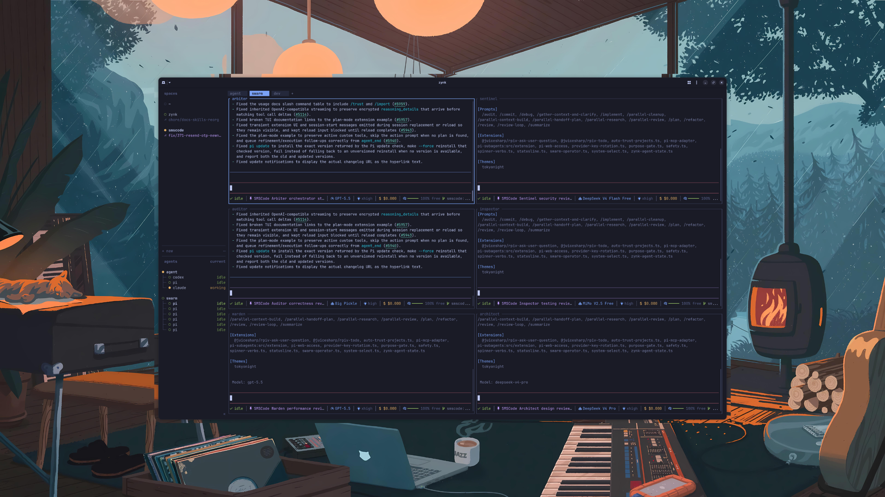

<p align="center">
  
</p>

<h1 align="center">zynk</h1>

<p align="center"><b>Terminal-native command center for AI agents.</b></p>

<p align="center">
  <a href="LICENSE"></a>
  <a href="https://github.com/dzevs/zynk/releases"></a>
  <a href="https://crates.io/crates/zynk"></a>
</p>

<p align="center">
  <a href="#install">Install</a> ·
  <a href="#quick-start">Quick start</a> ·
  <a href="#agent-messaging">Agent messaging</a> ·
  <a href="#supported-agents">Supported agents</a> ·
  <a href="#configuration">Configuration</a> ·
  <a href="#docs">Docs</a>
</p>

---

Run Claude, Codex, Pi, and other coding agents in **real terminal panes** — tmux-style workspaces, tabs, and
splits — then let them **message each other** over a native, persisted bus. Detach and the agents keep
running; reattach from anywhere. See every agent's state at a glance — blocked, working, done — and search the
whole conversation history later.

zynk is a single Rust binary that lives in the terminal you already use. It isn't a web dashboard, an Electron
shell, or a screenshot wrapper around someone else's view: you see each agent's own terminal, with a
coordination layer on top.

## Why zynk

Running many agents in terminals is powerful, and it turns chaotic fast — panes scattered across windows, no
clear "who's blocked", handoffs lost in scrollback, no shared memory or protocol between them.

zynk gives the terminal that missing coordination layer:

- **Workspaces, tabs, and panes** that persist across detach and full restart.
- **Agent awareness** — a sidebar that shows what every agent is doing right now.
- A **native message bus** — agents address each other by pane, with honest delivery state and a persisted,
  searchable history.

## Features

- **Real terminal workspaces** — workspaces (per repo or folder), tabs, and panes that are actual processes,
  not rewritten agent views.
- **Agent awareness** — blocked / working / done / idle, detected from process names and output, no hooks
  required.
- **Native agent messaging** — `zynk send` / `reply` / `thread` / `inbox` / `query`.
- **Persistent conversation store** — every message in a global SQLite DB, retrievable by keyword and meaning.
- **Detach / reattach + restore** — pane processes survive client detach; sessions restore panes after a full
  restart, with opt-in recent screen history.
- **Integrations** — official agent hooks add native session identity and semantic state reporting.
- Mouse-native throughout, 18 built-in themes, keyboard copy mode, and sound/toast notifications.

## Install

Install with Homebrew, download a prebuilt binary, use Nix, or build from source.

**Homebrew** (macOS and Linux):

```bash
brew install dzevs/tap/zynk
```

This installs the prebuilt v3.0.0 binary from [GitHub Releases](https://github.com/dzevs/zynk/releases); on
Linuxbrew the binary is glibc-dynamic and needs **glibc ≥ 2.30**.

**Prebuilt binary** (without Homebrew) — Linux x86_64 (glibc ≥ 2.30):

```bash
curl -LO https://github.com/dzevs/zynk/releases/download/v3.0.0/zynk-v3.0.0-linux-x86_64.tar.gz
curl -LO https://github.com/dzevs/zynk/releases/download/v3.0.0/SHA256SUMS
sha256sum --ignore-missing -c SHA256SUMS
tar -xzf zynk-v3.0.0-linux-x86_64.tar.gz && install -m 755 zynk ~/.local/bin/zynk
zynk --version
```

Targets: `linux-x86_64`, `linux-aarch64` (GNU/glibc dynamic, **glibc ≥ 2.30**), `macos-x86_64`,
`macos-aarch64`, `windows-x86_64` — always verify against `SHA256SUMS`.

> [!NOTE]
> The macOS and Windows binaries are **unsigned**. On macOS, clear the quarantine
> (`xattr -dr com.apple.quarantine ./zynk`); on Windows, use SmartScreen's "More info → Run anyway".

**Nix:**

```bash
nix run github:dzevs/zynk
```

**Build from source** — needs Rust (stable), **Zig 0.15.2** (the bundled `libghostty-vt` is built with Zig),
and **network access during the build** (the Zig build fetches libghostty-vt's package dependencies; offline
builds aren't supported yet). `cargo install zynk` builds the same 3.x crate from source under the same
requirements. See [`DEVELOPMENT.md`](DEVELOPMENT.md).

```bash
git clone https://github.com/dzevs/zynk && cd zynk
cargo build --release --locked
./target/release/zynk
```

## Quick start

Start zynk where the work lives:

```bash
zynk
```

zynk starts or attaches to one background session server and opens a workspace. Run an agent in the root pane.
The prefix is `ctrl+b`:

- `ctrl+b` then `shift+n` — new workspace
- `ctrl+b` then `v` / `minus` — split panes
- `ctrl+b` then `c` — new tab · `ctrl+b` then `w` — switch workspaces
- `ctrl+b` then `q` — detach (the server and pane processes keep running; run `zynk` again to reattach)

## Agent messaging

This is zynk's net-new layer on top of the multiplexer. Agents send each other **plain-text messages**; zynk
attaches structured protocol metadata, prepends a visible awareness header, persists every message to a global
SQLite store, tracks honest delivery state, and lets agents retrieve past messages by keyword and meaning.

```bash
zynk send  <target> <text> [--type review|approve|…]   # resolve target → atomic submit, persisted
zynk reply <target> <text>                             # parent auto-derived; no --reply-to
zynk thread <conversation>                             # read-only: walk a conversation
zynk inbox                                             # read-only: messages addressed to you
zynk who                                               # live agents / panes in the session
zynk query <text> [--workspace|--conversation|--agent|--since|--limit]   # hybrid retrieval
```

Design guarantees (binding):

- **Honest delivery.** Send results distinguish `drafted` and `submitted`; delivery events later advance to
  `received` through the server-authoritative `zynk.message_received` event, or to `failed` on delivery
  failure. zynk never collapses these states — `received` comes from the receiving integration's event, never
  from screen scraping or a socket ACK. A receiver without the zynk integration stays at `submitted`.
- **Body purity.** The message body is pure text; all provenance (identity, workspace/tab, branch, `git_sha`,
  cwd) plus zynk's protocol IDs persist as structured metadata, indexed apart from the body.
- **Structured responses.** No silent success and no bare `ok` — every command returns structured JSON plus
  concise human text, with `result`, the relevant ids, delivery state, and a `next` hint.
- **Read-only retrieval.** `query` / `thread` / `inbox` open the DB read-only (`PRAGMA query_only=1`) and write
  **zero** delivery events. `query` is hybrid: FTS5 keyword (BM25) + on-device embeddings via sqlite-vec, fused
  with RRF.

Agents can drive zynk over the same local Unix socket — create workspaces, split panes, spawn helpers, read
output, wait for state changes, and message each other. Start with [`SKILL.md`](SKILL.md).

## How it compares

|                                       | tmux | gui managers | zynk |
|---------------------------------------|:----:|:------------:|:----:|
| persistent sessions                   |  ✓   |      —       |  ✓   |
| detach / reattach                     |  ✓   |      —       |  ✓   |
| panes, tabs, workspaces               |  ✓   |      ✓       |  ✓   |
| agent awareness                       |  —   |      ✓       |  ✓   |
| lives in your terminal                |  ✓   |      —       |  ✓   |
| real terminal views                   |  ✓   |      —       |  ✓   |
| mouse-native                          |  —   |      ✓       |  ✓   |
| agents can orchestrate                |  ?   |      ?       |  ✓   |
| native agent-to-agent messaging       |  —   |      —       |  ✓   |
| persisted + retrievable conversation  |  —   |      —       |  ✓   |

tmux gives you persistence and panes, but predates agents. GUI managers show agent state, but they make you
leave your terminal for their wrapped view. zynk is persistence, awareness, and a native multi-agent
conversation layer in one tool that stays out of your way.

## Supported agents

Automatic detection works out of the box — process-name matching plus terminal-output heuristics.

| agent | idle / done | working | blocked |
|-------|:-----------:|:-------:|:-------:|
| [pi](https://pi.dev) | ✓ | ✓ | partial |
| [claude code](https://docs.anthropic.com/en/docs/claude-code) | ✓ | ✓ | ✓ |
| [codex](https://github.com/openai/codex) | ✓ | ✓ | ✓ |
| [droid](https://factory.ai) | ✓ | ✓ | ✓ |
| [amp](https://ampcode.com) | ✓ | ✓ | ✓ |
| [opencode](https://github.com/anomalyco/opencode) | ✓ | ✓ | ✓ |
| [grok CLI](https://x.ai/grok) | ✓ | ✓ | ✓ |
| [github copilot CLI](https://github.com/features/copilot) | ✓ | ✓ | ✓ |
| [qodercli](https://qoder.com/cli) | ✓ | ✓ | ✓ |
| cursor agent · antigravity CLI · kimi code CLI · kilo code CLI · hermes agent | ✓ | ✓ | ✓ |
| [kiro CLI](https://kiro.dev/docs/cli/) | ✓ | ✓ | — |

Detected but not fully tested: gemini CLI, cline. For agents outside the list, zynk still works as a terminal
multiplexer; custom integrations can report agent labels over the socket API. Install official integrations
with `zynk integration install <agent>` (`claude`, `codex`, `copilot`, `droid`, `pi`, `opencode`, and more).

## Keybindings

Press `ctrl+b` to enter prefix mode; default actions are prefix-first and tmux-like.

| key | action | | key | action |
|-----|--------|-|-----|--------|
| `prefix+c` | new tab | | `prefix+shift+n` | new workspace |
| `prefix+n` / `p` | next / previous tab | | `prefix+shift+g` | new worktree |
| `prefix+1..9` | switch tab | | `prefix+v` / `minus` | split pane |
| `prefix+w` | workspace navigation | | `prefix+x` | close pane |
| `prefix+h/j/k/l` | focus pane | | `prefix+z` | zoom pane |
| `prefix+shift+h/j/k/l` | swap pane | | `prefix+b` | toggle sidebar |
| `prefix+g` | session navigator | | `prefix+q` | detach |

Mouse works throughout. For copy: drag-select inside a pane, or `prefix+[` for keyboard copy mode (`v` to
select, `y` to copy, `q` to leave).

## Configuration

zynk separates **config** from **data**:

- **Config:** `~/.config/zynk/config.toml` (override the path with `ZYNK_CONFIG_PATH`).
- **Data:** the global conversation SQLite DB at `~/.zynk/zynk.db` (override the data home with `ZYNK_HOME`, or
  the DB directory with `ZYNK_SQLITE_HOME`).

```bash
zynk --default-config   # print the full default config
```

If a database from an earlier build already occupies `~/.zynk/zynk.db`, zynk **fails closed** rather than
overwrite it, and points you at the explicit `zynk db` adopt/backup/import action.

> [!NOTE]
> Auto-update and update channels stay fail-closed until release-manifest hosting exists, so `zynk update`
> doesn't fetch yet. Update with `brew upgrade dzevs/tap/zynk`, a newer release binary, Nix, or a source
> rebuild — then stop the old server (`zynk server stop`) so the new binary takes effect.

## Docs

- [`SKILL.md`](SKILL.md) — reusable agent skill for driving zynk over the socket
- [`AGENTS.md`](AGENTS.md) — how co-author / reviewer agents work in this repo
- [`CLAUDE.md`](CLAUDE.md) — project guide for the implementer (architecture, commands, conventions)
- [`DEVELOPMENT.md`](DEVELOPMENT.md) — build, run, and test from source
- [`CONTRIBUTING.md`](CONTRIBUTING.md) — how to contribute · [`CODE_OF_CONDUCT.md`](CODE_OF_CONDUCT.md)

## Contributing

Contributions are welcome through GitHub issues and pull requests. Read [`CONTRIBUTING.md`](CONTRIBUTING.md)
first, build from source with [`DEVELOPMENT.md`](DEVELOPMENT.md), and run `just check` before opening a PR. If
you're an AI agent working on this repo, read [`AGENTS.md`](AGENTS.md) before making changes.

## License & provenance

zynk is a fork of **[herdr](https://github.com/ogulcancelik/herdr)**, a terminal workspace manager by
ogulcancelik and the herdr contributors. zynk keeps herdr's terminal-multiplexer foundation and adds a net-new
multi-agent conversation layer (global persistence, structured protocol metadata + a visible message header,
honest delivery, and hybrid retrieval).

zynk is distributed under the **GNU Affero General Public License v3.0 or later** (AGPL-3.0-or-later); the fork
preserves that license unchanged. Upstream copyright notices and the AGPL license are preserved — see
[`LICENSE`](LICENSE) and [`NOTICE`](NOTICE).

- Copyright © ogulcancelik and the herdr contributors (upstream herdr).
- Copyright © 2026 Zevs &lt;hi@zevs.gg&gt; — the zynk fork and its additions.

The `zynk` crate on crates.io (the 2.x line) was a separate, now-retired protocol/helper CLI (MIT). This native
terminal app continues the name at the **3.x** line under AGPL-3.0-or-later — a different, new product. New
zynk-layer code is AGPL-3.0-or-later as part of the combined work; per AGPL, complete corresponding source is
available with any conveyed or network-served build.
