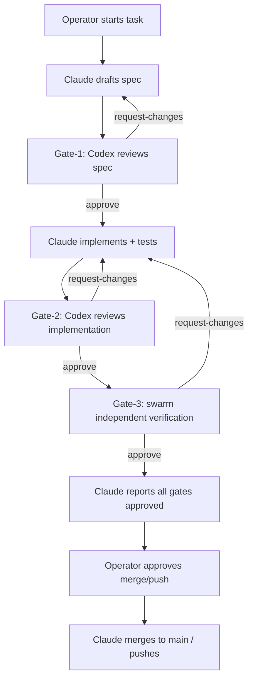

# WORKFLOW.md — zynk development & review gates

Authoritative for how zynk is developed and released. Read this before any state-changing repo operation
(merge, push, tag, release, publish). It separates collaborative development from independent verification so
unverified agent output never reaches `main`. Project conventions live in `CLAUDE.md`; agent operating rules in
`AGENTS.md`.

## Roles

- **Operator** — starts tasks; gives the final explicit merge / push / release approval.
- **Claude** — the single implementer/executor. Only Claude edits files, commits, and runs approved
  merge/push/tag/release operations, and waits for an explicit operator gate per action.
- **Codex** — collaborative reviewer (Gate-1 spec + Gate-2 implementation). A co-author, not independent.
- **Swarm** — Gate-3 independent verification: a fan-out of specialist reviewers, decorrelated from the author.
- **Pi** — coordinator / relay; READ-ONLY verification. Doesn't write code, commit, or push.
- **zynk** — the audited transport; the conversation is the verdict record.

## Binding rules

1. No merge / push / tag / release / publish until the operator explicitly approves — each is a separate gate.
2. No "ready to merge" claim until Gate-1, Gate-2, and Gate-3 all approve.
3. Pi must not edit source files or write code; Pi coordinates and verifies read-only.
4. On any gate/check failure: STOP, fix the root cause, re-run until clean. Never bypass (`--no-verify` is forbidden).
5. Local builds/tests use an isolated `CARGO_TARGET_DIR`, never the live runtime.
6. Precise `git add <path>` — never `git add -A`. Lowercase conventional commits; never force-push `main`.

## Gate overview

```text
Gate-1: Codex reviews the spec for soundness.
Gate-2: Codex reviews the implementation.
Gate-3: a swarm independently verifies the change.
Operator: merge/push approval only after Gate-1 + Gate-2 + Gate-3 approve.
```

## Full workflow



## `Gate-1` — spec soundness

Claude writes a spec, then asks Codex to review it (`zynk send <codex-pane> --type request-review --trace <id>
-- "<text>"`). Codex may iterate with Claude until the spec is sound. Gate-1 passes only when Codex explicitly
approves the final spec.

## `Gate-2` — collaborative implementation review

Claude implements the approved spec with tests, then asks Codex to review the diff. Codex may request changes;
Claude and Codex iterate. Gate-2 passes only when Codex explicitly approves the implementation.

## `Gate-3` — swarm independent verification

After Gate-2, Claude requests an independent **swarm** verification, decorrelated from the author. Use the
global `swarm` skill: an arbiter fans out specialist reviewers (e.g. correctness, security, regression,
does-it-reproduce), collects and cross-verifies their findings, and reports one verdict through the audited
zynk conversation (`zynk thread` / `zynk trace <id>`).

Manual fallback (no swarm skill available): Claude `zynk send`s the change to three or more reviewer panes with
distinct lenses, collects their `zynk reply` verdicts, and treats a majority-confirm as the Gate-3 verdict.

Allowed Gate-3 verdicts: `approve`, `request-changes`, `blocked-insufficient-evidence`, `blocked-harness-failure`.

## Failure handling

- **request-changes** — a real issue was found. Claude/Codex re-enter the implementation loop; a new Gate-2 and a new Gate-3 are required.
- **blocked-insufficient-evidence** — the change couldn't be verified (incomplete proof/diff). Claude corrects the evidence; no code change is implied; re-verify.
- **blocked-harness-failure** — the verifier environment/tooling failed. Fix the harness; re-verify the same candidate.

## Merge rule

Claude may report "ready to merge" only when ALL are true: Gate-1 (Codex spec) approved, Gate-2 (Codex impl)
approved, Gate-3 (swarm) `approve` recorded in the audited conversation, Claude has checked every cited
`file:line`, and the operator explicitly approves. Merge to `main` is a fast-forward; pushes are operator-gated;
never force-push.

## Private content gate

Two-plus fail-closed layers run in pre-commit (`just install-hooks`) AND CI (`.github/workflows/gates.yml`):

- **Structural** `scripts/check_public_tree.py` — fails if a forbidden/private path is tracked.
- **Scrub** `scripts/scrub_check.py` — fails on product-specific reference terms in copied tooling/docs.
- **Content** `gitleaks` (`.gitleaks.toml`) — fails on private strings.

Run whole-tree with `just gate`. On any failure: STOP, fix the root cause, never bypass.

## Release gates (each a separate operator gate)

A GitHub binary release (`vX.Y.Z` tag + assets + `SHA256SUMS`), a crates.io publish (`cargo publish`), and the
Homebrew tap bump each need a separate explicit operator approval. Never tag / release / publish / yank /
bump-version / force-push without one. Released tags are immutable provenance anchors.

## Message bodies (native zynk)

```text
Request review : zynk send <pane> --type request-review  --trace <id> -- "<spec/diff + scope + risk labels>"
Approve        : zynk send <pane> --type approve          --trace <id> -- "APPROVE. <evidence: report/diff + file:line>"
Request changes: zynk send <pane> --type request-changes  --trace <id> -- "REQUEST_CHANGES. <specifics>"
```
