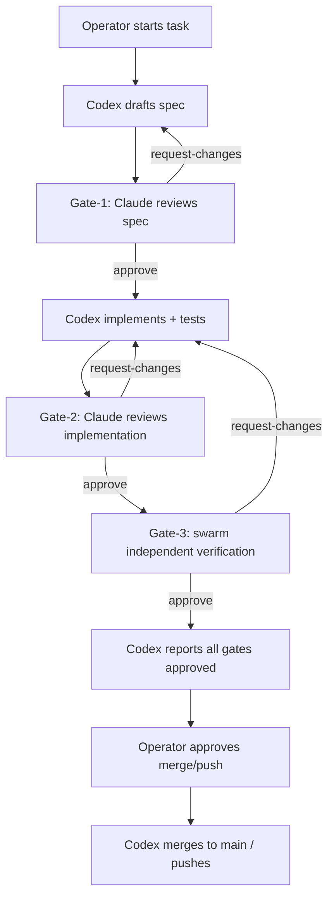

# WORKFLOW.md — zynk development & review gates

Authoritative for how zynk is developed and released. Read this before any state-changing repo operation
(merge, push, tag, release, publish). It separates collaborative development from independent verification so
unverified agent output never reaches `main`. Project conventions live in `CLAUDE.md`; agent operating rules in
`AGENTS.md`.

## Roles

- **Operator** — starts tasks; gives the final explicit merge / push / release approval.
- **Codex** — the single implementer/executor. Only Codex edits files, commits, and runs approved
  merge/push/tag/release operations, and waits for an explicit operator gate per action.
- **Claude** — collaborative reviewer (Gate-1 spec + Gate-2 implementation) and context owner, read-only
  on implementation. A co-author, not independent.
- **Swarm** — Gate-3 independent verification: a fan-out of specialist reviewers, decorrelated from the author.
- **Pi** — coordinator / relay; READ-ONLY verification. Doesn't write code, commit, or push.
- **zynk** — the audited transport; the conversation is the verdict record.

The operator reassigned these roles on 2026-09-09 for the remaining B1 corrections and Linux-only v0.8.2
port. Prior approvals remain valid only for their recorded ranges under the original reviewers.
Transferring implementation ownership does not approve inherited commits.

## Binding rules

1. No merge / push / tag / release / publish until the operator explicitly approves — each is a separate gate.
2. No "ready to merge" claim until Gate-1, Gate-2, and Gate-3 all approve.
3. Pi must not edit source files or write code; Pi coordinates and verifies read-only.
4. On any gate/check failure: STOP, fix the root cause, re-run until clean. Never bypass (`--no-verify` is
   forbidden). Every check is required — zynk builds for one target (ADR 0013), so there is no informational tier.
5. Local builds/tests use an isolated `CARGO_TARGET_DIR`, never the live runtime.
6. Precise `git add <path>` — never `git add -A`. Lowercase conventional commits; never force-push `main`.
7. Freeze the candidate branch and worktree from review submission until the consolidated verdict.
   No candidate edits, new commits, or teammate fixes while that review is open; reviewer probes belong in
   isolated copies. After the verdict, address the collected required findings in one bounded batch.
8. Review the successor delta and affected invariants. Nonblocking notes do not reopen accepted,
   unchanged areas; reopening requires concrete regression evidence. No fresh broad review fan-out
   while corrections to its parent are in progress. Separate approved milestones require separate worktrees.

## Gate overview

```text
Gate-1: Claude reviews the spec for soundness.
Gate-2: Claude reviews the implementation.
Gate-3: a swarm independently verifies the change.
Operator: merge/push approval only after Gate-1 + Gate-2 + Gate-3 approve.
```

## Full workflow


```mermaid
flowchart TD
  A[Operator starts task] --> B[Codex drafts spec]
  B --> C[Gate-1: Claude reviews spec]
  C -->|request-changes| B
  C -->|approve| D[Codex implements + tests]
  D --> E[Gate-2: Claude reviews implementation]
  E -->|request-changes| D
  E -->|approve| F[Gate-3: swarm independent verification]
  F -->|request-changes| D
  F -->|approve| G[Codex reports all gates approved]
  G --> H[Operator approves merge/push]
  H --> I[Codex merges to main / pushes]
```

## `Gate-1` — spec soundness

Codex writes a spec, then asks Claude to review it (`zynk send <claude-pane> --type request-review --trace <id>
-- "<text>"`). Claude may iterate with Codex until the spec is sound. Gate-1 passes only when Claude explicitly
approves the final spec.

## `Gate-2` — collaborative implementation review

Codex implements the approved spec with tests, then asks Claude to review the diff. Claude may request changes;
Codex waits for the consolidated verdict before editing again. Gate-2 passes only when Claude explicitly
approves the implementation; an author never issues their own review approval.

## `Gate-3` — swarm independent verification

After Gate-2, Codex requests an independent **swarm** verification, decorrelated from the author. Use the
global `swarm` skill: an arbiter fans out specialist reviewers (e.g. correctness, security, regression,
does-it-reproduce), collects and cross-verifies their findings, and reports one verdict through the audited
zynk conversation (`zynk thread` / `zynk trace <id>`).

Manual fallback (no swarm skill available): Codex `zynk send`s the change to three or more reviewer panes with
distinct lenses, collects their `zynk reply` verdicts, and treats a majority-confirm as the Gate-3 verdict.

Allowed Gate-3 verdicts: `approve`, `request-changes`, `blocked-insufficient-evidence`, `blocked-harness-failure`.

## Failure handling

- **request-changes** — a real issue was found. After the consolidated verdict, Codex fixes the collected required findings; a new Gate-2 and scoped Gate-3 are required.
- **blocked-insufficient-evidence** — the change couldn't be verified (incomplete proof/diff). Codex corrects the evidence; no code change is implied; re-verify.
- **blocked-harness-failure** — the verifier environment/tooling failed. Fix the harness; re-verify the same candidate.

## Merge rule

Codex may report "ready to merge" only when ALL are true: Gate-1 (Claude spec) approved, Gate-2 (Claude impl)
approved, Gate-3 (swarm) `approve` recorded in the audited conversation, Codex has checked every cited
`file:line`, and the operator explicitly approves. Merge to `main` is a fast-forward; pushes are operator-gated;
never force-push.

## Private content gate

Two-plus fail-closed layers run in pre-commit (`just install-hooks`) AND CI (`.github/workflows/gates.yml`):

- **Structural** `scripts/check_public_tree.py` — fails if a forbidden/private path is tracked.
- **Scrub** `scripts/scrub_check.py` — fails on product-specific reference terms in copied tooling/docs.
- **Content** `gitleaks` (`.gitleaks.toml`) — fails on private strings.

Run whole-tree with `just gate`. On any failure: STOP, fix the root cause, never bypass.

## Release gates (each a separate operator gate)

A `vX.Y.Z` tag and a crates.io publish (`cargo publish`) each need a separate explicit operator approval.
Never tag / release / publish / yank / bump-version / force-push without one. Released tags are immutable
provenance anchors. zynk builds for Linux x86_64 only (ADR 0013): one target, no release artifacts to verify.

**Release gates** (a failure stops the release, never bypassed): `just check` — the same path as CI
`check-required` (`just check` on Ubuntu); `just gate` (the private-content gates, `gates.yml`); conventional
commits; Gate-1 / Gate-2 / Gate-3 on exact SHAs; and the operator merge/push gate. Fedora validation is the
operator's dogfood of a binary built locally from the exact reviewed SHA, recorded in the gate with that SHA,
the binary's sha256, the version and the exercised session/send/receipt/recovery flows; the installed live
binary isn't evidence for an uninstalled candidate.

Enforcement: `dzevs/zynk` has no branch protection or rulesets, so "required" is enforced by this procedure
reading the named jobs. If rulesets are ever introduced, the PR/push-required check names are `check-required`,
`conventional-commits` and `gates`.

## Message bodies (native zynk)

```text
Request review : zynk send <pane> --type request-review  --trace <id> -- "<spec/diff + scope + risk labels>"
Approve        : zynk send <pane> --type approve          --trace <id> -- "APPROVE. <evidence: report/diff + file:line>"
Request changes: zynk send <pane> --type request-changes  --trace <id> -- "REQUEST_CHANGES. <specifics>"
```
